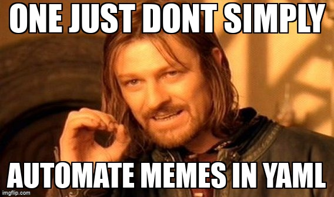

<p align="center"></p>


# Meme as code
* Why? Because one just don't simply automate memes. 
* What does it do? Just define a yaml with the memes and captions and it will download them from https://imgflip.com


# Usage
```
git clone https://github.com/daviddetorres/meme-as-code
cd meme-as-code
make build

./meme-as-code --help
  Usage of ./meme-as-code:
    -config-file string
          The path to the config file. (default "config.yaml")
    -output-dir string
          The path where to download memes. (default "output")
    -override
          Override existing files.

USER=your-user PASS=your-pass ./meme-as-code
```

You can customize your memes by editing the `config.yaml` file.

## Limitations
* It only allows to make memes with 2 text boxes.
* Consult the memes available by ID [here](https://imgflip.com/popular_meme_ids). 
